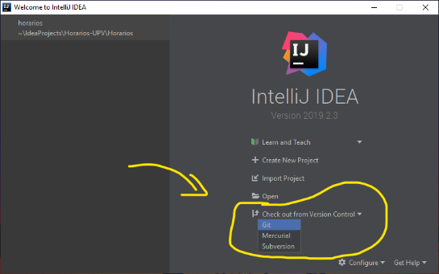
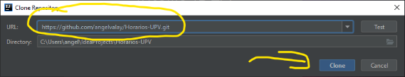

# Sistema de creacion de horarios de la UPV
### Requerimientos para hacer funcionar el proyecto:
1. Se requiere tener Java 11.0.3 o superior.
2. Se requiere tener al menos la version de Java 12.0.2. Junto con el
   requerimiento 1. (En caso de presentar problemas con el Java 11)
3. Se requiere tener la version de Maven 3.6.1 o superior.

>Se recomienda usar IntelliJ Idea 2019.2.3 o superior como IDE para el
>desarrollo. Desconocemos el proceso para el funcionamiento del sistema
>con otras IDE (Netbeans, Eclipse, etc).

### Pasos de instalacion
#### Importar el repositorio localmente
Primero, abrimos la IDE IntelliJ Idea. Daremos clic a la opcion *Check
out from Version Control*. Y luego clic a la opcion de *Git*.

Copiamos la siguiente URL
[https://github.com/angelvalay/Horarios-UPV.git](https://github.com/angelvalay/Horarios-UPV.git).
Y la pegamos en la parte de *URL* y le damos *Clone* para continuar.

