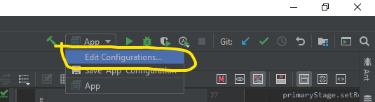

# Sistema de creacion de horarios de la UPV

### **LEAN TODO Y PREGUNTEN.**

### Requerimientos para hacer funcionar el proyecto:
1. Se requiere tener Java 11.0.3 o superior.
2. Se requiere tener al menos la version de Java 12.0.2. Junto con el
   requerimiento 1. (En caso de presentar problemas con el Java 11)
3. Se requiere tener la version de Maven 3.6.1 o superior.
4. Para alguna modificacion o agregacion al diseno, se requiere JavaFX
   Scene Builder 2.0.

>Se recomienda usar IntelliJ Idea 2019.2.3 o superior como IDE para el
>desarrollo. Desconocemos el proceso para el funcionamiento del sistema
>con otras IDE (Netbeans, Eclipse, etc).

### Pasos de instalacion
#### Importar el repositorio localmente
Primero, abrimos la IDE IntelliJ Idea. Daremos clic a la opcion *Check
out from Version Control*. Y luego clic a la opcion de *Git*.


Copiamos la siguiente URL
[https://github.com/angelvalay/Horarios-UPV.git](https://github.com/angelvalay/Horarios-UPV.git).
Y la pegamos en la parte de *URL* y le damos *Clone* para continuar.


Enseguida nos pregunta si deseamos directamente importar el proyecto con
el archivo POM. Selecciona *Yes* para continuar.


### Proceso para ejecutar el proyecto
Para iniciar con la ejecucion del proyecto, asegurese de tener
correctamente esta estructura del proyecto.


Abra el archivo App.java


Da clic en el icono de play color verde o CTRL+SHIFT+F10 para ejecutar
la aplicacion.


### Posibles errores/soluciones
Si a la hora de ejecutar el archivo App.java ocurrio el siguiente error:

```
... 
Caused by: java.lang.IllegalAccessError: class com.sun.javafx.fxml.FXMLLoaderHelper (in unnamed module @0x11bb3fa1)
cannot access class com.sun.javafx.util.Utils (in module
javafx.graphics) because module javafx.graphics does not export
com.sun.javafx.util to unnamed module @0x11bb3fa1
...
```

Esto problamente se deba a que estas corriendo el archivo con una
version no compatible con el plugin utilizado, para solucionarlo,
actualiza la version del JDK de compilacion al 11.0.3 o superior. 

Selecciona la opcion de editar configuracion.



Luego cambia la version del JDK a la 11. Y luego a *Ok*


E intenta nuevamente compilar el archivo App.java.

### Nota importante
Los archivos JavaFX utilizan un plugin para el diseno *JFoenix*. Para
mas informacion sobre la instalacion de este plugin ve el siguiente
[enlace](http://www.jfoenix.com/) para el proceso de instalacion.

### Importacion de la base de datos 
Para lograr importar la base de datos requerira el archivo SQL que se
encuentra ubicado en la carpeta de src/main/resources/sql, hay esta el
archivo que importara mediante su SGBD preferido (yo recomiendo para
este caso usar phpMyAdmin).

## Observacion
Los archivos JavaFX (.fxml) que se encuentra ubicados en la carpeta de
*src/main/resources/view* no son compilados, por lo que cada vez que se
agregue o edite un archivo de estos, se tendra que **sobreescribir** con
los que estan en la carpeta de *target/classes/view*.